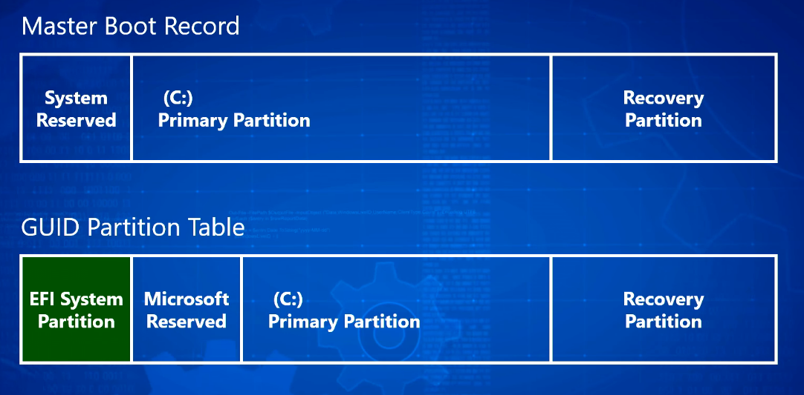
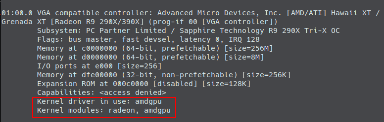

# My Linux Tips and Tricks

- [My Linux Tips and Tricks](#my-linux-tips-and-tricks)
	- [MRB & GPT. Linux install](#mrb--gpt-linux-install)
		- [TL;DR](#tldr)
		- [MBR](#mbr)
		- [GPT](#gpt)
	- [Install `bash` as the default shell](#install-bash-as-the-default-shell)
	- [Manjaro Gnome](#manjaro-gnome)
		- [Apps](#apps)
		- [Clean cache, remove orphan packages](#clean-cache-remove-orphan-packages)
		- [`grub`](#grub)
		- [On AMD switch to the `amdgpu` driver](#on-amd-switch-to-the-amdgpu-driver)
		- [Keyboard shortcuts](#keyboard-shortcuts)
	- [Installing app from the source code](#installing-app-from-the-source-code)
	- [Symlink](#symlink)
	- [`$PATH`](#path)
	- [Integrate a program into the system](#integrate-a-program-into-the-system)
	- [Users and groups](#users-and-groups)
		- [Shared folder (between users):](#shared-folder-between-users)
	- [`youtube-dl`](#youtube-dl)
	- [`scrcpy`](#scrcpy)
		- [Setup](#setup)
		- [Options](#options)

***


## MRB & GPT. Linux install

### TL;DR

Use `GPT`. For `UEFI-GPT` Manjaro you'll usually need 3 partitions: 

1. `fat32` 100 MB with `esp` and `boot` flags and `/boot/efi` mount point.
2. `ext4` root, 50 GB with `/` mount point.
3. `ext4` home, any size with `/home` mount point. 

To convert your `MBR` to `GPT` you can use the `MBR2GPT` tool for Windows: https://www.youtube.com/watch?v=hfJep4hmg9o  



If you have `BIOS-MBR` and don't want to convert, you'll need `fat32/ntfs` (~500 MB) partition with a `boot` flag and `/boot` mount point. 

### MBR 

Master Boot Record - the old method of marking the disk space. Compatible with `Legacy BIOS`. 

Has a limit of 4 volumes (one of which can be extended if needed and include more logical volumes). 

Has a limit of 2 TB per volume. 

Stores the volume data at one place - the beginning of each volume. If this section is damaged - the volume is gone.

### GPT

GUID Partition Table - the new method of marking the disk space. Compatible with `UEFI` (Unified Extensible Firmware Interface) - "new BIOS".

Has no limitations of MBR. 

Stores the volume data in multiple places across the volume, so it's more robust. 

***


## Install `bash` as the default shell

`max` is the user name, use yours. 

```
sudo pacman -S bash
sudo chsh -s /bin/bash max
```

If it doesn't work, try killing the current session (maybe it blocks the changing):

```
who
pkill -KILL -u dom
```

***


## Manjaro Gnome

http://gigenet.dl.osdn.jp/storage/g/m/ma/manjaro/Manjaro-User-Guide.pdf

### Apps

Refresh the mirror list and update the system:

```
sudo pacman-mirrors -f && sudo pacman -Syyuu
```

Delete unneeded apps:

```
sudo pacman -Rs gnome-maps transmission-gtk lollypop steam-manjaro
```

Install apps (for Gnome on Manjaro):

```
sudo pacman -S git nodejs npm electron totem vlc gimp code audacious anki gnome-boxes telegram-desktop eog bleachbit opera ffmpeg qbittorrent wine wine-mono wine-gecko wireshark-qt calibre gcolor3 baobab gthumb kolourpaint evince lutris youtube-dl flatpak gnupg flameshot ciano adapta-gtk-theme gtkhash gnome-software xclip gnome-notes
```

Manually from Pamac install **AUR** packages:

```
radeon-profile corectrl dxvk-bin google-chrome stacer postman-bin skype scrcpy fondo
```

**Themes**: You should have **Kvantum Manager** (kvantum-gt5) installed. Choose **KvMojave** there. Also from Pamac **Materia** for your DE.

Intel: 

```
sudo pacman -S lib32-mesa vulkan-intel lib32-vulkan-intel vulkan-icd-loader lib32-vulkan-icd-loader vkd3d
```

AMD: 

```
sudo pacman -S lib32-mesa vulkan-radeon lib32-vulkan-radeon vulkan-icd-loader lib32-vulkan-icd-loader
```

Nvidia: 

```
sudo pacman -S nvidia nvidia-utils lib32-nvidia-utils nvidia-settings vulkan-icd-loader lib32-vulkan-icd-loader
```

***

Also check `torproject.org` and `keeweb.info`.

***


### Clean cache, remove orphan packages

Can be helpful when experiencing errors like `Update error: failed to commit transaction (invalid or corrupted package)`

```
sudo pacman -Sc && paccache -rvk0
```

Then update the mirror list and the system:

```
sudo pacman-mirrors -f && sudo pacman -Syyuu 
```

***

Orphan packages are those who left behind after all the packages that depended on them were removed. They do not serve any purpose anymore. To remove them, type:

```
sudo pacman -Rs $(pacman -Qqtd)
```

***


### `grub`

Open `/etc/default/grub`

Decrease timeout: `GRUB_TIMEOUT=3`

Optionally switch to `amdgpu` (see the next chapter).

Optionally change the `grub` theme: 

1. Copy the theme folders to `/boot/grub/themes`
2. Edit `/etc/default/grub` : uncomment the line with the path to the theme file (at the bottom):
`GRUB_THEME="/boot/grub/themes/Vimix/theme.txt"` (Vimix is the theme folder name).

Reconfigure `grub` after changing its settings:

```
sudo grub-mkconfig -o /boot/grub/grub.cfg
# Or this: 
# sudo update-grub
```

If system didn't come up, just edit the `grub` in the startup by pressing `E`, and delete the added part, and press `CTRL + X` to start with edited `grub`.

***


### On AMD switch to the `amdgpu` driver

https://www.youtube.com/watch?v=Mr_UFL5ZeKQ

Commands:
```
lspci -v
```



Turn on the **amdgpu** driver. Open
```
sudo nano /etc/modprobe.d/amdgpu.conf
```

and insert 2 lines inside:

```
options amdgpu si_support=1
options amdgpu cik_support=1
```

Turn off the **radeon** driver. Open

```
sudo nano /etc/modprobe.d/radeon.conf
```

and insert 2 lines inside: 

```
options radeon si_support=0
options radeon cik_support=0
```

Edit the **grub config**. Open it:

```
sudo nano /etc/default/grub
```

find the `GRUB_CMDLINE_LINUX_DEFAULT` line and insert the following at the beginning of it: 

```
radeon.cik_support=0 amdgpu.cik_support=1 radeon.si_support=0 amdgpu.si_support=1
```

**Reconfigure grub** for the changed to come into effect: 

```
sudo grub-mkconfig -o /boot/grub/grub.cfg
```

If the system didn't come up, just edit `grub` at startup by pressing `E`, delete the added part and press `CTRL + X` to start with edited `grub`.

***


### Keyboard shortcuts

Free `Print`, then set it to run `flameshot gui`.

Set `Ctrl + Exc` to run `gnome-system-monitor`.

***

Gnome extensions: `Arc Menu`, `Clipboard Indicator`, `KStatusNotifierItem/AppIndicator Support`, `OpenWeather`, `Removable Driver Menu`, `Time++`, `Unite`.

***


## Installing app from the source code

The installation method may vary. Follow the instructions with the provided app. Or try this:

```
./configure 
make
sudo make install
```

to delete, go the same directory from which you installed and type:

```
sudo make uninstall
```
***

If videos freeze, try deleting `xf86-video-intel`

***


## Symlink

To create a soft link: `ln -s <file/folder to be linked> <path to the link>`. The last argument is optional.


`-s` stands for `soft` or `symbolic` (instead of the `hard` links).

```
# Link to Downloads in the current directory
ln -s /home/max/Downloads Down
```

To delete a link: `unlink <path to link>`. Or simply delete the link file.

```
unlink Down
```

If the file of folder you linked was moved/renamed/deleted, your link will be broken. You can find them and delete (recursive for all the nested folders):

```
# find and show
find ./ -xtype l 

# find and delete
find ./ -xtype l -delete
```

***


## `$PATH`

A variable representing a list of directories where the system looks for programs.

```
# See the current $PATH content:
echo $PATH

# or the formatted version:
# echo "${PATH//:/$'\n'}"

# Add a folder to $PATH:
export PATH=$PATH:~/Apps

# Now you can run your apps located in ~/Apps by their names:
subsurface
```

But after a reload, your addition vanishes. To make it permanent, add `export PATH=$PATH:~/Apps` to the `~/.profile`

***


## Integrate a program into the system

To integrate a program into your OS you basically need 2 things:

1. Your program should be accessible from the `$PATH`.
2. There should be a `.desktop` file referring to it in `~/.local/share/applications` (for GUI access).

Put a symlink to your program (or the program itself) to any folder present in your `$PATH`, for example `/usr/local/bin` or `~/.local/bin` (or add your own folder to the `$PATH`). Large applications can be put to `/opt` (and then linked the same way). But this might not work for some programs as `/opt` is a `root` directory. 

Create a .desktop file and put it in `~/.local/share/applications`. 
You can look at any existing `.desktop` file for an example or see one here: https://wiki.archlinux.org/index.php/Desktop_entries 
Optionally put it into one of the existing categories from this list: https://specifications.freedesktop.org/menu-spec/menu-spec-1.0.html#category-registry

Example - KeeWeb.desktop: 

```
[Desktop Entry]
Type=Application
Name=KeeWeb
GenericName=Passwords
Exec=KeeWeb
Icon=/home/max/.icons/keeweb-icon.png
Categories=Utility;
```

***


## Users and groups

User **groups** are basically **css classes**: a user can be a member of a number of groups. One of them is called **primary** - the group that the files and folders created by the user will be assigned to. It is the same of the user name by default.

**Create a new group**: `sudo groupadd <groupname>`

**Add a user to a group**: `sudo usermod -aG <groupname> <username>`. Btw, in Manjaro you need to add user to the group `wheel`, not `sudo` when you want to give him the root privileges.

Use `sudo groupdel groupname` to **delete a group**.


### Shared folder (between users):

1. Add both users to the same group (using the `manjaro-settings-manager` GUI or the `usermod -aG groupname username` command).
2. Prepare a shared folder:
   1. Create a folder: `mkdir /share`
   2. Set its owner group (so the members of the group can access it): `sudo chgrp share /share`
   3. Set permissions for the folder (+ the default group for the inside files using **setgid**): `sudo chmod 2770 /share`
   4. Set the default file access control lists (permissions for the inside files): `sudo setfacl -d -m g::rwX /share`

***


## `youtube-dl`

Basic:
```
youtube-dl https://www.youtube.com/watch?v=RONSglJJhro
```
***

Audio only: `-f bestaudio`
***

Audio and video separately: `-f "bestvideo,bestaudio"`

merged: `-f 'bestvideo+bestaudio'`
***

Check available formsts: `-F`

(then use the number): `-f 247`

or preferred format: `-f mp4`
***

Thumbnail only: `--write-thumbnail --skip-download`
***

Subs: `--write-sub`
***

Add metadata to the file: `--add-metadata`
***

No more than: `-f best[filesize<200M]`

Download a playlist: `--playlist-items 2,3,7,10` or `--playlist-start 3 --playlist-end 9`
***

Download from other sites: play the video, go to the DevTools => Network => File column => copy URL (often .m3u8 - a playlist of chunks), paste something like: `youtube-dl https://load.hdrezka-ag.net/tvseries/86dafe83fc8e564e1424fceac1fce037f6437885/155ed3a28eaa0fb72e4680c9c624c19a:2019120800/720.mp4:hls:manifest.m3u8`

***


## `scrcpy`

https://github.com/Genymobile/scrcpy

### Setup

App for displaying your Android screen on your PC.

Install from AUR.

**Run using USB**:

1. On Android: enable USB-debugging
2. Connect your Android to your PC via USB
3. On PC: `scrcpy`

**Setup running via WiFi**:

1. On Android: enable USB-debugging in Settings
2. Connect your Android to your PC via USB
3. On Android check the phone's IP: `Settings` -> `About Phone` -> `Status` -> `IP Address`
4. On PC: 

```
adb tcpip 5555				# connect your device to the port
adb connect 192.168.1.3		# enter your phone's IP here
adb devices					# check if the connection is established
```

5. **Disconnect USB**

**Run using WiFi** (after setup is finished):

1. On PC: `scrcpy`

***

### Options

**Reduce size** to increase performance: 

```
scrcpy --max-size 800
scrcpy -m 800
```

**Change bit-rate**:

```
scrcpy --bit-rate 2M
scrcpy -b 2M
```

**Limit frame rate**:

```
scrcpy --max-fps 15
```

***

**Record screen**:

```
scrcpy --record file.mp4
scrcpy -r file.mkv
```