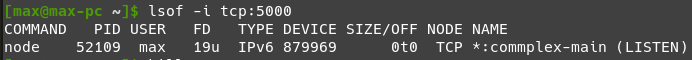

# Linux Shell

- [Linux Shell](#linux-shell)
	- [Aliases](#aliases)
	- [`echo`](#echo)
	- [Wildcards](#wildcards)
	- [I/O Redirection](#io-redirection)
		- [`grep`](#grep)
	- [Permissions](#permissions)
		- [`chmod`](#chmod)
		- [`chown` and `chgrp`](#chown-and-chgrp)
		- [`setuid`](#setuid)
		- [`setgid`](#setgid)
		- [`sticky`](#sticky)
		- [`setfacl`](#setfacl)
	- [Job Control](#job-control)
		- [`ps x`](#ps-x)
		- [`kill`](#kill)
		- [`lsof`](#lsof)

---

## Aliases

Create a shortcut to an existing command:

```bash
alias gs='git status '
alias ga='git add '
alias gb='git branch '
alias gc='git commit'
alias gd='git diff'
alias gco='git checkout '
alias gf='git fetch '
alias gp='git push '
alias gl='git log --pretty=format:"%h %ad | %s%d [%an]" --graph --date=short'
```

---

## `echo`

Basically `console.log` - prints text or expressions passed.

```bash
echo $HOME				# /home/max
echo $USER				# max
echo $((2 + 2))			# 4
```

---

## Wildcards

Basically regexp.

| Pattern                  | Matches                                                         |
| ------------------------ | --------------------------------------------------------------- |
| `*`                      | Any characters                                                  |
| `g*`                     | Filenames starting with 'g'                                     |
| `b*.txt`                 | Filenames starting with 'b' and ending with '.txt'              |
| `?`                      | Single character                                                |
| `data???`                | Filenames starting with 'data' and followed by any 3 characters |
| `[abc]`                  | Any character from the set                                      |
| `[!abc]`                 | Any character expect from the set                               |
| `[:digit:]`              | Numeric POSIX class                                             |
| `[:upper:]`, `[:lower:]` | Uppercase, lowercase                                            |
| `[[:upper:]]*`           | Uppercase character followed by anything                        |
| `*[![:lower:]]`          | Any filename that does not end with a lowercase letter          |

Double quotes `""` used to escape everything except `$`, backslashes and backticks.

Single quotes `''` used to escape everything.

---

## I/O Redirection

The results of the commands be default are sent to the **standard output** - display. We can redirect it to a file using `>` to **set** and `>>` to **append**

```bash
# overwrite the file with each new call
ls > ls_result

# append new data to the file
ls >> ls_result
```

To redirect the **standard input** from the keyboard to the file, use `<`

```bash
# reverse sort the content of the file line by line
sort -r < ls_result
```

The result is displayed on the screen since this is a **standard output**. We can again redirect it to the file:

```bash
sort -r < ls_result > sorted_ls_result
```

---

We can use **pipelines** `|` to redirect the standard output of one command to the standard input of another.

```bash
ls -l | less
```

---

### `grep`

Basically `str.match(regexp)`.

Structure: `grep pattern files` or `some input | grep pattern`.

Use this file for testing: `unix.txt`

```bash
UNix
OMGunixOID.
linux Unix which one you choose.
uNix is easy to learn.unix is a multiuser os.Learn unix .unix is a powerful.
```

| Flag       | Description                                                | Example                         | Result                            |
| ---------- | ---------------------------------------------------------- | ------------------------------- | --------------------------------- |
| -          | -                                                          | `grep 'unix' unix.txt`          | lines 2, 4                        |
| `-v`       | inverted match, `!`                                        | `grep -v 'unix' unix.txt`       | lines 1, 3                        |
| `-i`       | case-insensitive                                           | `grep -i 'unix' unix.txt`       | all 4 lines                       |
| `-c`       | count of the matches                                       | `grep -c 'unix' unix.txt`       | 2                                 |
| `-l`       | list of the files with matches                             | `grep -l 'unix' * > result.txt` | result.txt with 'unix.txt' inside |
| `-w`       | word matches                                               | `grep -iw 'unix' unix.txt`      | lines 1, 3, 4                     |
| `-x`       | string matches                                             | `grep -ix 'unix' unix.txt`      | line 1                            |
| `-o`       | display only the matched pattern instead of the whole line | `grep -io 'unix' unix.txt`      | 7 matched words                   |
| `^pattern` | line starting with a pattern                               | `grep -i '^unix' unix.txt`      | lines 1, 4                        |
| `pattern$` | line finishing with a pattern                              | `grep -i 'nix$' unix.txt`       | line 1                            |

---

### `scp`

Copy files to a remote server via SSH.

```bash
# Copy all files in a folder using `key` from `source` to `host:target`
scp -r -i audio_ember_staging.pem ./audio_member ubuntu@ec2-3-97-128-84.ca-central-1.compute.amazonaws.com:/home/ubuntu/audio_ember
```

---

## Permissions

Each file and directory is assigned access rights for the **owner** of the file, the **members of a group** of related users, and **everybody else**.

Rights can be assigned to **read** a file, to **write** a file, and to **execute** a file.

We can use `ls -l filename` to see the rights.

```bash
ls -l /bin/bash

# -rwxr-xr-x 1 root root 928016 лип 10 19:57 /bin/bash
```

`bash` is owned by the user `root` belonging to the group `root`.

- The superuser can **read**, **write** and **execute** the file
- Members of the group `root` can **read** and **execute**
- Everybody else can **read** and **execute**

Think of the permission settings as a series of bits:

| Attributes  | Binary      | Decimal |
| ----------- | ----------- | ------- |
| rwx rwx rwx | 111 111 111 | 777     |
| rw- rw- rw- | 110 110 110 | 666     |
| rwx --- --- | 111 000 000 | 700     |

---

### `chmod`

Change permissions for a file.

There are two ways to change permissions:

1. By setting an octal number

```bash
chmod 700 unix.txt
```

2. By setting a symbolic representation of changes. The combination of:
   1. `u`, `g`, `o`
   2. `+`, `-`, `=`
   3. `r`, `w`, `x`

```bash
chmod g=rw,u=rwx,o=r unix.txt
chmod u-rwx unix.txt
chmod o+w unix.txt
```

The common permission sets:

| Decimal      | Attributes               | What for                                                    |
| ------------ | ------------------------ | ----------------------------------------------------------- |
| `755`        | `rwxr-xr-x`              | Common programs used by everybody                           |
| `666`        | `rw-rw-rw`               | Common files to read and write by everybody                 |
| `644`        | `rw-r--r--`              | Files that everybody can read but only the owner to modify. |
| `700`, `600` | `rwx------`, `rw-------` | Private files for the owner only                            |

---

`chmod` can also be used for directory permissions.

- `r` allows the content of the dir to be listed if `x` is also set.
- `w` allows files within the directory to be created, deleted, or renamed if `x` is also set.
- `x` allows a directory to be entered (i.e. `cd dir`).

The common permissions sets for directories:

| Decimal | Attributes  | What for                                                                                  |
| ------- | ----------- | ----------------------------------------------------------------------------------------- |
| `755`   | `rwxr-xr-x` | The owner has full rights, everybody else can list and read files but not modify anything |
| `700`   | `rwx------` | The owner had full rights, everybody else can do nothing - private directory.             |

---

**Change permissions for all directories inside a directory**:

```bash
sudo find /opt/lampp/htdocs -type d -exec chmod 755 {} \;
```

**Change permissions for all files inside a directory**:

```bash
sudo find /opt/lampp/htdocs -type f -exec chmod 644 {} \;
```

---

### `chown` and `chgrp`

**Change Owner** and **Change Group**.

```bash
chown username file.txt
chgrp groupname file.txt
```

---

### `setuid`

Set User Id. Only affects files.

When the `setuid` bit is set, an **executable** runs not with the privileges of the user launching it but with the **privileges of the owner**.

It is set by adding `4` before the standard octal number:

```bash
chmod 4777 myprog
```

or by adding `s` to the `user`:

```bash
chmod u+s myprog
```

The file must be executable (`x`) for this feature to work. If it was executable, `s` will replaces `x`. If it wasn't, `S` will replace `x` (and nothing will work).

```bash
ls -l
# -rwsr--r-- 1 max share
```

---

### `setgid`

Set Group Id. Affects both files and folders.

When set on a file, an **executable** file will run with the privileges of the **group of the owner** instead of the usual group of the user running it.

When set on a foler, makes the **group** of the **files created inside** the directory to belong to the **group of the directory** itself, not to the usual group of the creator. This is very useful for the shared folders: set the common folder group to `share` and all the files created inside will have this group by default, regardless of the user who creates them.

It is set by adding `2` before the standard octal number:

```bash
chmod 2770 myprog		# file
chmod 2770 /share		# folder
```

or by adding `s` to the `group`:

```bash
chmod g+s myprog		# file
chmod g+s /share		# the actual settings for the shared folder
```

Result:

```bash
ls -l
# drwxrws---   2 root share
```

Remember: the file/folder should also be executable. The capital `S` will indicate that it is not!

---

### `sticky`

Affects directories.

Makes **all the files** inside the directory **only modifiable by their owners**. Typically used for directories writable by all users to make impossible for one of them deleting the files or another.

It is set by adding `1` before the standard octal number:

```bash
chmod 1777 /tmp
```

or by adding `t` to the `others'` permissions:

```bash
chmod o+t /tmp
```

Result:

```bash
ls -l
# drwxrwxrwt  20 root root
```

Again, capital `T` will indicate that `x` is not present for `others` (and the sticky bit won't work either).

---

### `setfacl`

Set File Access Lists. Basically the default permissions for the files inside a directory.

```bash
setfacl -d -m g::rwX /<directory>	# group
setfacl -d -m o::rX /<directory>	# others
```

Files cannot be set executable by default!

---

## Job Control

Put the process to sleep pressing `CTRL + Z`. Wake up typing `bg`.

```bash
# Run Wireshark for test
sudo wireshark

# Then put it to sleep. And later wake up
```

---

### `ps x`

List all processes for all users:

```bash
ps x
```

Pipe the output through the `grep` to find a process you need:

```bash
# Assumimg `gnome-system-monitor` is running

ps x | grep monitor
```


---

### `kill`

Sends the `kill` signal to the process.

```bash
# Assuming `gnome-system-monitor` is running

ps x | grep monitor
kill 10063
```

List the signals available

```bash
kill -l
```

The standard signal of `kill` is `15`. The most severe is `9` - in this case not the process kills itself but the kernel kills a process.

```bash
ps x | grep monitor
kill -9 10063
```

---

### `lsof`

Lists open files for running processes.

Example: find the process running at the specific port:

```bash
# Find the process running at port 5000
lsof -i tcp:5000

# Find and kill the process running at port 5000
lsof -i :5000 -t | xargs kill
```


