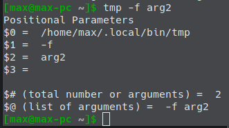

# Shell Scripts

- [Shell Scripts](#shell-scripts)
  - [Debugging](#debugging)
  - [Variables](#variables)
  - [Input](#input)
  - [`if`](#if)
  - [`case`](#case)
  - [Loops](#loops)
    - [`shift`](#shift)
  - [Shell Functions](#shell-functions)
  - [Positional parameters](#positional-parameters)
  - [Arithmetic](#arithmetic)
  - [Example](#example)

---

A shell script is a file containing a series of commands. The shell reads this file and carries out the commands as though they have been entered directly on the command line.

To successfully write a shell script, you have to do three things:

1. Write a script
2. Give the shell permission to execute it
3. Put it somewhere the shell can find it

---

Open a text editor and type

```bash
#!/bin/bash
# My first script

echo "Hello World!"
echo "Second message"
```

You can use semicolor `;` as a delimeter and place different commands on one line.

Save the file as e.g. `hello-world`.

The first line of the script is important. This is a special clue, called a shebang, given to the shell indicating what program is used to interpret the script. In this case, it is `/bin/bash`. Other scripting languages such as Perl, awk, tcl, Tk, and python also use this mechanism.

Now we need to give the shell peimission to execute the script (in the file location folder):

```bash
chmod 755 hello-world
```

Now run your script (from the same folder):

```bash
./hello-world
```

It will print a message to the terminal.

---

The `$PATH` variable stores all the places where the shell would seek the programs to execute. You can add your script there to execute it without specifiyng the path. See the [Tips and Tricks](01.tips-and-tricks.md) chapter for more details.

The easiest way is to place your scripts to `~/.local/bin`

After this simply type (from anywhere):

```bash
hello-world
```

---

## Debugging

Add ` -x` to the first line to enable logging to the console. You can use `echo` as well.

---

## Variables

The dollar sign `$` says "substitude the results of the enclosed command".

```bash
num=33
str="Titi Kaka"
echo $num, $str         # 33, Titi Kaka
```

---

## Input

```bash
#!/bin/bash

echo -n "Enter some text > "        # message w/o new line
read text                           # cin >> text
echo "You entered: $text"
```

`read -t 3` sets timeout in seconds to finish accepting input.

`read -s` disables displaying the input (like password).

---

## `if`

```bash
if commands; then
    commands
    elif commands; then
        commands
    else
        commangs
fi
```

`true` of `false` is determined by the exit status returned. `0 == true`, anything else - `false`.

Use the `test` command to return `true/false`. It returns `0` when the expression is `true` and `1` when it's `false`. Attention to the spaces after and before square brackets!

```bash
test expression
# or
[ expression ]
```

If the current directory has a file/folder with `hello` in its name, return `true` and echo 'yes', else - `false` and echo 'no'.

```bash
if [ $(ls | grep hello) ]; then echo 'yes'; else echo 'no'; fi
```

Some of the conditions `test` can evaluate.

| Expression | Description                                |
| ---------- | ------------------------------------------ |
| `-d file`  | True if file is a directory.               |
| `-e file`  | True if file exists.                       |
| `-f file`  | True if file exists and is a regular file. |
| `-L file`  | True if file is a symbolic link.           |
| `-r file`  | True if file is a file readable by you.    |

E.g.

```bash
if [ -f hello-world ]
then
    echo "file exists"
else
    "file doesn't exist"
fi

# file exists
```

---

Doing comparisons you'll need to either **double quote** every expression, or **double square bracket** them:

```bash
input
if [ "$aug1" == "and" ];
```

```bash
input
if [[ $aug1 == "and" ]];
```

---

## `case`

```bash
#!/bin/bash

echo -n "Enter your name: "
read name

case $name in
    'max')
        echo 'My name is Max';;
    'maria')
        echo 'My name is Maria';;
    [0-9])
    	echo 'You typed a digic character';;
     *)
     	echo 'Default answer';;
esac
```

---

## Loops

There are 3 kind of loops: `while`, `until`, `for`.

Regular `while` loop - condition to continue

```bash
#!/bin/bash

number=0
while [ $number -lt 10 ]    # less than
do
	echo "Number == $number"
	number=$((number + 1))
done
```

Vise versa `until` loop - condition to stop

```bash
#!/bin/bash

number=0
until [ $number -ge 10 ]    # greater or equal
do
	echo "Number == $number"
	number=$((number + 1))
done
```

`for`:

```bash
for i in word1 word2 word3; do
    echo $i
done
```

```bash
for filename in "$@"; do
    ...
done
```

---

### `shift`

Shifts the arguments left by 1. You can use this command to iterate over the arguments. Call this with 2 arguments (e.g. `tmp arg1 arg2`):

```bash
#!/bin/bash

# Loop until all parameters are used up
while [ "$1" != "" ]; do
	echo "You now have $# positional parameters"
    echo "Parameter 1 == $1"

    # Shift all the parameters down by one
    shift
done
```

---

## Shell Functions

Repeatable code. Type this in your script file `~/.local/bin/hello-world`:

```bash
today() {
    echo -n "Today's date is: "
    date +"%A, %B %-d, %Y"
}

today
```

Then run in the terminal:

```bash
hello-world
```

It should show a message with the current date.

Functions should **never be empty**.

---

## Positional parameters

Imagine such a command:

```bash
program word1 word2 word3
```

We can get access to all the parameters (including the command itself), using `$0`, `$1` etc. The total number or arguments is stored in the `$#` variable:

```bash
#!/bin/bash

echo "Positional Parameters"
echo '$0 = ' $0
echo '$1 = ' $1
echo '$2 = ' $2
echo '$3 = ' $3

echo ''
echo '$# (total number or arguments) = ' $#
echo '$@ (list of arguments) = ' $@
```



---

## Arithmetic

The shell works with **integer** numbers only. You need special tools (`bc`) to work with fractionals.

```bash
#!/bin/bash

echo -n "Enter the first number --> "
read first_num
echo -n "Enter the second number -> "
read second_num

echo "first number / second number = $((first_num / second_num))"
```

Notice that you don't need `$` to reference variables inside the arithmetic expression.

---

## Example

A program generating HTML with the info about your sytem.

```bash
#!/bin/bash

# sysinfo_page - A script to produce an system information HTML file

##### Constants

TITLE="System Information for $HOSTNAME"
RIGHT_NOW=$(date +"%x %r %Z")
TIME_STAMP="Updated on $RIGHT_NOW by $USER"

##### Functions

system_info(){
    # Find any release files in /etc

    if ls /etc/*release 1>/dev/null 2>&1; then
        echo "<h2>System release info</h2>"
        echo "<pre>"
        for i in /etc/*release; do

            # Since we can't be sure of the
            # length of the file, only
            # display the first line.

            head -n 1 $i
        done
        uname -orp
        echo "</pre>"
    fi
}

show_uptime(){
    echo "<h2>System uptime</h2>"
    echo "<pre>"
    uptime
    echo "</pre>"
}

drive_space(){
    echo "<h2>Filesystem space</h2>"
    echo "<pre>"
    df
    echo "</pre>"
}

home_space(){
    echo "<h2>Home directory space by user</h2>"
    echo "<pre>"
    format="%8s%10s%10s   %-s\n"
    printf "$format" "Dirs" "Files" "Blocks" "Directory"
    printf "$format" "----" "-----" "------" "---------"
    if [ $(id -u) = "0" ]; then
        dir_list="/home/*"
    else
        dir_list=$HOME
    fi
    for home_dir in $dir_list; do
        total_dirs=$(find $home_dir -type d | wc -l)
        total_files=$(find $home_dir -type f | wc -l)
        total_blocks=$(du -s $home_dir)
        printf "$format" $total_dirs $total_files $total_blocks
    done
    echo "</pre>"
}

##### Main

cat <<- _EOF_
  <html>
  <head>
      <title>$TITLE</title>
  </head>

  <body>
      <h1>$TITLE</h1>
      <p>$TIME_STAMP</p>
      $(system_info)
      $(show_uptime)
      $(drive_space)
      $(home_space)
  </body>
  </html>
_EOF_
```
