# Wireshark Learn By Doing Tutorial

- [Wireshark Learn By Doing Tutorial](#wireshark-learn-by-doing-tutorial)
  - [Useful commands](#useful-commands)
    - [Find out your IP](#find-out-your-ip)
    - [Find out IP from a hostname](#find-out-ip-from-a-hostname)
  - [Three-way handshake (`SYN`, `SYN-ACK`, `ACK`)](#three-way-handshake-syn-syn-ack-ack)
  - [Wireshark Intro](#wireshark-intro)
    - [Display Filters](#display-filters)
    - [Capture Filters](#capture-filters)
  - [Client-youtube conversation](#client-youtube-conversation)

---

## Useful commands

### Find out your IP

```
ip route
```

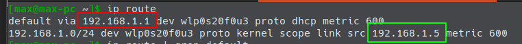

Red is your router IP while green is your device's.

---

### Find out IP from a hostname

```bash
ping youtube.com
```

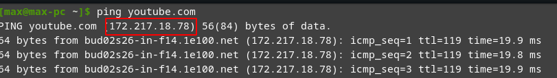

---

## Three-way handshake (`SYN`, `SYN-ACK`, `ACK`)

A process which is used in a TCP/IP network to make a connection between the server and client. It is a three-step process that requires both the client and server to exchange `synchronization` and `acknowledgment` packets before the real data communication process starts.

| Message   | Description                                                                                                     |
| --------- | --------------------------------------------------------------------------------------------------------------- |
| `SYN`     | Used to initiate and establish a connection. It also helps you to synchronize sequence numbers between devices. |
| `ACK`     | Helps to confirm to the other side that it has received the SYN.                                                |
| `SYN-ACK` | SYN message from local device and ACK of the earlier packet.                                                    |
| `FIN`     | Used to terminate a connection.                                                                                 |


1. In the first step, the client establishes a connection with a server. It sends a segment with SYN and informs the server about the client should start communication, and with what should be its sequence number.
2. In this step server responds to the client request with SYN-ACK signal set. ACK helps you to signify the response of segment that is received and SYN signifies what sequence number it should able to start with the segments.
3. In this final step, the client acknowledges the response of the Server, and they both create a stable connection will begin the actual data transfer process.

## Wireshark Intro

Run with `sudo`.

First, choose the interface you want to listen to. The first one is probably the way to go.

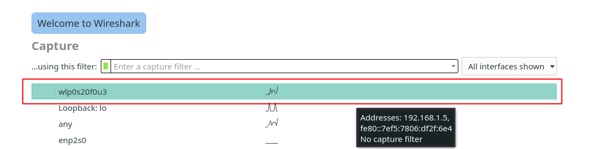

You can change the interface later. Stop the current session and click `Capture options` on the panel.

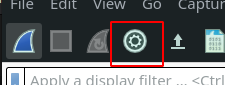

### Display Filters

To find `https` search for `tls`.

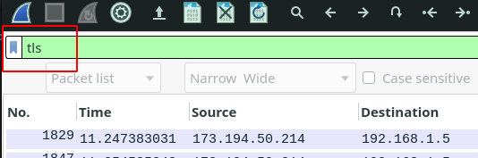

Filter the `ip` address:

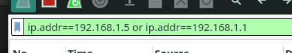

Packets send by the `ip`:

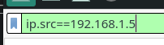

Packets received by the `ip`:

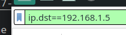

`Port`:

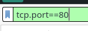

Specific ports

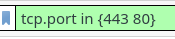

HTTPS and youtube IP. You can use both `||`, `&&` and `or`, `and`.

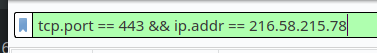

`Contains`:

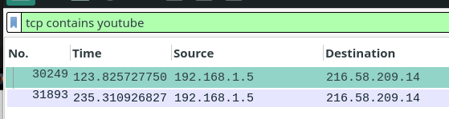

### Capture Filters

Go the `Capture Options` and type the filter you need. E.g. `http`:

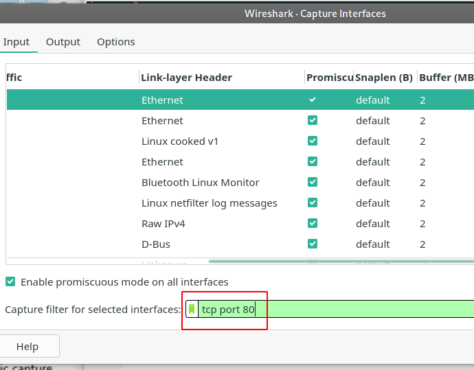

or

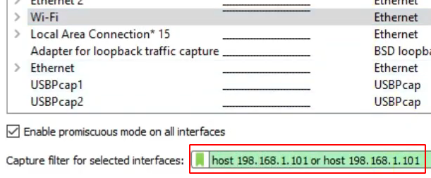

`Portrange`:

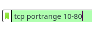

---

## Client-youtube conversation

Start the recording session and go to `youtube` in a browser.

Search `frame contains youtube`.

Find `Client Hello` -> right click -> Conversation Filter -> TCP

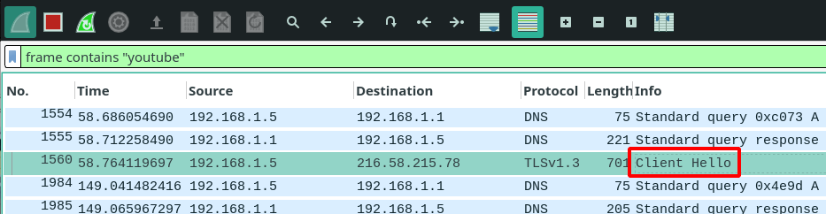

Now watch the conversation between client and server.

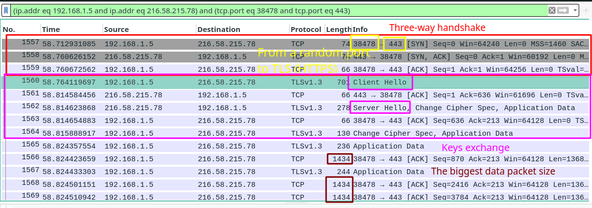
